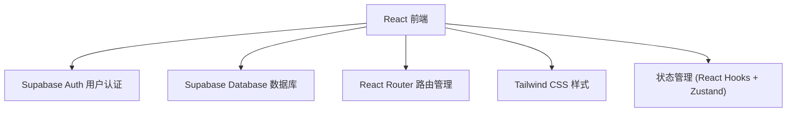
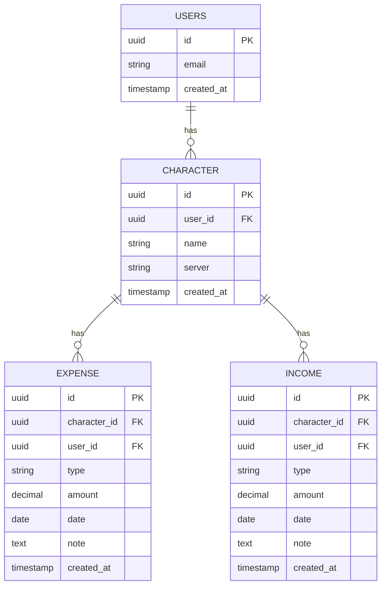

## 1. 架构设计


## 2. 技术描述
- **前端**：React@18 + TypeScript + Tailwind CSS@3 + Vite
- **初始化工具**：vite-init
- **后端**：Supabase（BaaS - Backend as a Service）
- **数据库**：PostgreSQL（Supabase）
- **认证**：Supabase Auth（支持邮箱/密码登录）

## 3. 路由定义
| 路由 | 用途 |
|------|------|
| / | 首页/人物列表（需要登录） |
| /login | 登录页 |
| /signup | 注册页 |
| /character/:id | 人物详情（展示消费和收入分类） |
| /character/:id/expense/:type | 消费记录详情页 |
| /character/:id/income/:type | 收入记录详情页 |

## 4. 数据模型

### 4.1 数据模型定义


### 4.2 TypeScript 类型定义
```typescript
interface Character {
  id: string;
  user_id: string;
  name: string;
  server: string;
  created_at: string;
}

interface Expense {
  id: string;
  character_id: string;
  user_id: string;
  type: 'point' | 'month' | 'year' | 'equipment' | 'pet';
  amount: number;
  date: string;
  note: string;
  created_at: string;
}

interface Income {
  id: string;
  character_id: string;
  user_id: string;
  type: 'money' | 'pet' | 'equipment';
  amount: number;
  date: string;
  note: string;
  created_at: string;
}
```

## 5. 核心组件设计
- `CharacterList`：人物列表组件
- `CharacterCard`：人物卡片组件
- `RecordList`：记录列表组件
- `AddCharacterForm`：添加人物表单组件
- `AddRecordForm`：添加记录表单组件
- `Login`：登录组件
- `Signup`：注册组件
