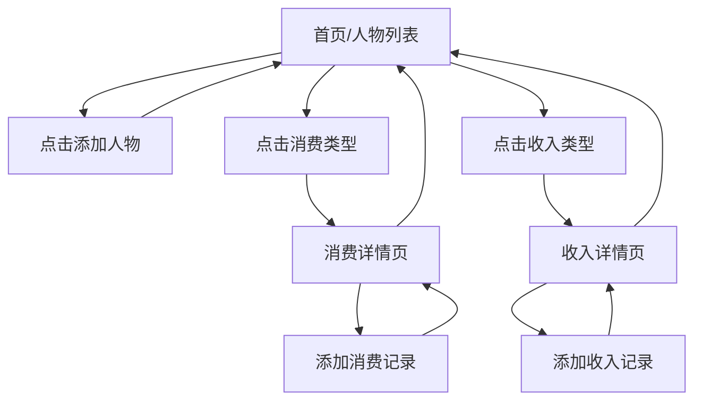

## 1. 产品概述
梦幻西游消费记录系统，帮助玩家记录和管理游戏内的消费与收入情况，提供清晰的财务统计和详细记录查看功能。
- 解决玩家在游戏过程中难以统计和追踪多个人物角色消费与收入的问题
- 目标用户：梦幻西游玩家，尤其是多角色玩家

## 2. 核心功能

### 2.1 用户角色
| 角色 | 注册方式 | 核心权限 |
|------|----------|----------|
| 普通用户 | 无需注册，本地存储 | 所有功能完全访问 |

### 2.2 功能模块
1. **人物管理页**：人物列表展示、添加/编辑/删除人物、统计概览
2. **消费记录页**：消费类型分类展示、添加消费记录、查看详细列表
3. **收入记录页**：收入类型分类展示、添加收入记录、查看详细列表

### 2.3 页面详情
| 页面名称 | 模块名称 | 功能描述 |
|----------|----------|----------|
| 首页/人物列表 | 人物卡片 | 显示角色名称、服务器、总消费、总收入、各类型统计 |
| 首页/人物列表 | 添加人物 | 创建新角色，填写基本信息 |
| 消费详情页 | 消费记录列表 | 显示特定角色特定类型的所有消费记录 |
| 收入详情页 | 收入记录列表 | 显示特定角色特定类型的所有收入记录 |
| 添加记录页 | 记录表单 | 添加消费或收入记录，填写金额、日期、备注 |

## 3. 核心流程
用户进入应用 → 查看人物列表概览 → 点击消费/收入分类查看详细记录 → 添加新的消费/收入记录 → 数据实时更新统计

## 4. 用户界面设计
### 4.1 设计风格
- **主色调**：梦幻西游主题色 - 深蓝色(#1a365d) + 金色(#d69e2e)
- **按钮风格**：圆角按钮，带有微妙的阴影和悬停动画
- **字体**：使用思源黑体 + Noto Serif SC，保证中文显示美观
- **布局风格**：卡片式布局，清晰的信息层级
- **图标风格**：使用游戏相关的emoji图标，增强代入感

### 4.2 页面设计概述
| 页面名称 | 模块名称 | UI元素 |
|----------|----------|--------|
| 首页 | 人物卡片 | 渐变背景卡片、数据高亮显示、悬停效果 |
| 详情页 | 记录列表 | 时间轴样式列表、金额色彩区分（消费红色、收入绿色） |
| 表单页 | 输入表单 | 简洁的表单设计、清晰的提示文字、提交反馈动画 |

### 4.3 响应式设计
- Mobile-first 设计，优先适配手机端
- 触摸优化，按钮和可点击区域足够大
- 适配各种屏幕尺寸，从手机到平板再到桌面

### 4.4 数据模型
- **人物**：id、名称、服务器、创建时间
- **消费记录**：id、人物id、类型（点卡/月卡/年卡/装备/宝宝）、金额、日期、备注
- **收入记录**：id、人物id、类型（出菜/宝宝/装备）、金额、日期、备注
